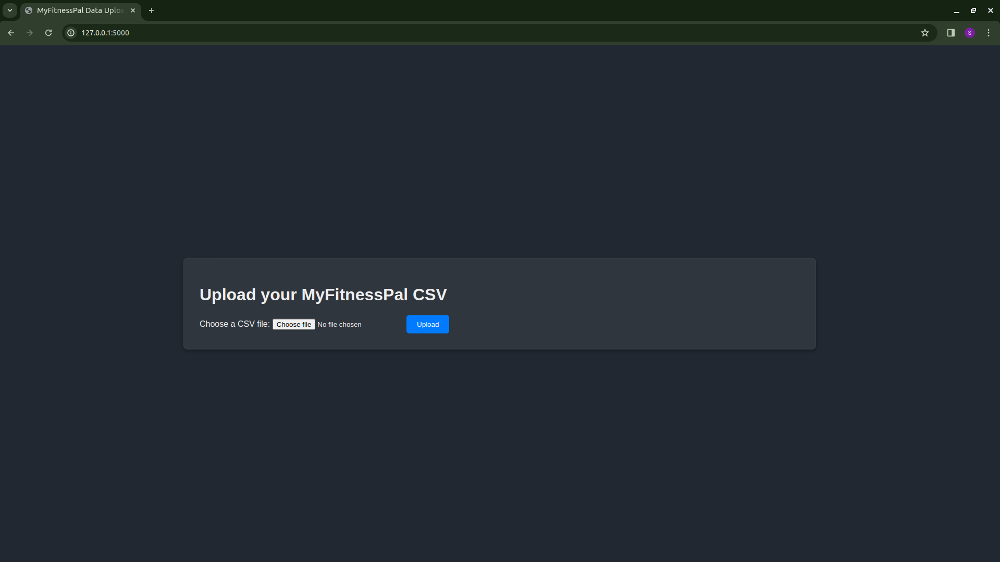
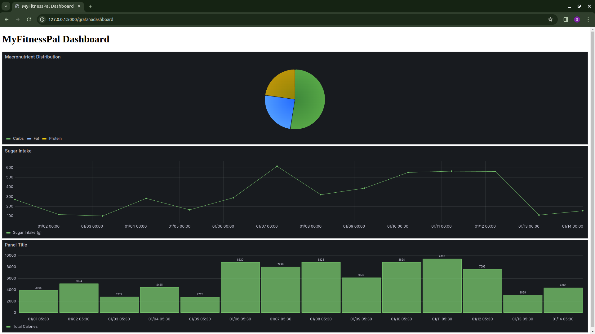

# MyFitnessPal CSV to Grafana 

This Python Flask application streamlines the process of generating informative Grafana dashboards using CSV data exported from the MyFitnessPal app. Easily transform your raw fitness data into visually appealing and insightful health tracking dashboards.

## Problem Statement

MyFitnessPal is a mobile app used to track food & energy intake, exercise, and more. It supports CSV data export (e.g., through email) to facilitate archival. However, analyzing raw CSV files can be cumbersome for gaining actionable insights. 

A simple website that accepts CSV exports and renders clear visual representations using Grafana would offer a significant improvement for users. 

## Solution

This application provides a streamlined workflow:

1. **CSV Upload:** Users upload their MyFitnessPal CSV export.
2. **Data Transformation:** The application converts the CSV data into a structured SQL database table.
3. **Automatic Visualization:**  A dynamic Grafana dashboard is generated, presenting key health and fitness metrics.

 

## Application Setup

1. Download the project locally.
2. Install the required dependencies using the `requirements.txt` file.
3. Create the database and table in your database system.
4. Set up your Grafana dashboard with the desired visualizations.
5. Edit necessary files with your specific links and credentials.
6. Run your project locally.
7. Access your project through localhost.

## Error Possibilities

1. **Dependency Installation:**  Simple Google searches can usually resolve most installation issues.
2. **Grafana Configuration:** You might need to make changes to the `defaults.ini` file in Grafana to resolve any "localhost can't be resolved" errors within the browser's iframe. Specifically:

   * **cookie_samesite = none**
   * **allow_embedding = true** 

## Anonymous Authentication (Optional)

If you want to enable anonymous access to Grafana, set the following in your configuration:

**[auth.anonymous]**

**enabled = true**

For any query, contact me on forsurya02@gmail.com